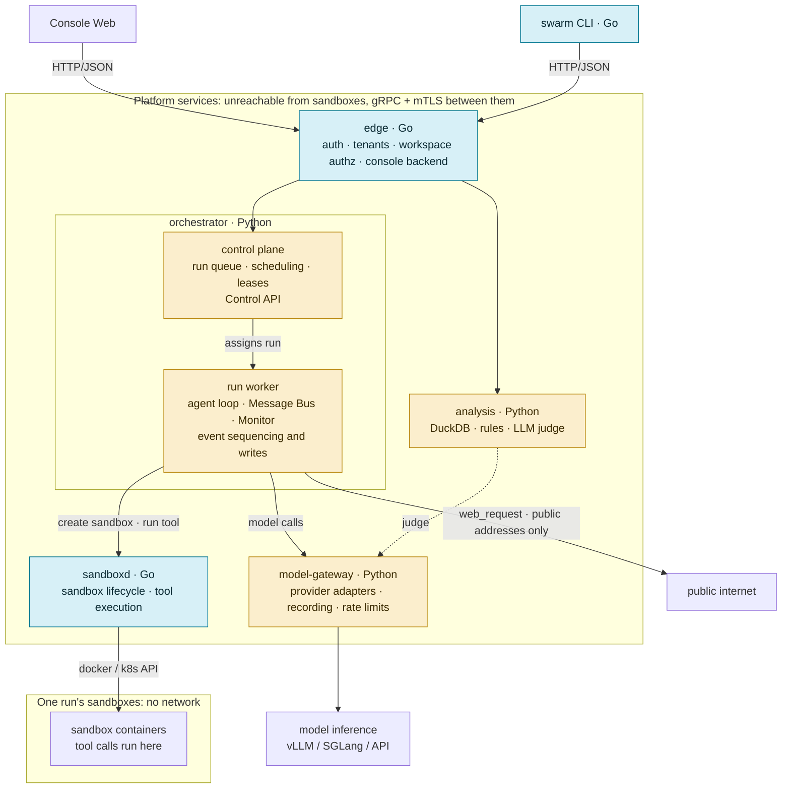
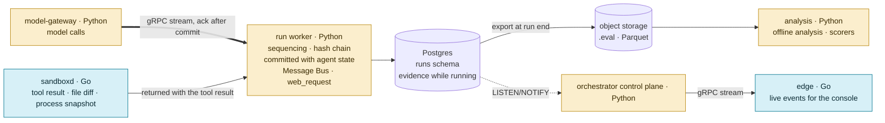

# Architecture

How SwarmEval is put together: which services exist, what each one owns, how they talk, where
data lives, and how the pieces are isolated. Only the project skeleton is built so far; the
**Status** column says which milestone brings each service; the milestones are defined in the
v1 spec §9. Why it is shaped this way is in the
[v1 spec](../spec/2026-09-27-swarmeval-v1/README.md) and the
[runtime spec](../spec/2026-09-28-runtime-sandbox-logs/README.md). Decisions the runtime spec still lists as
open questions are marked *(open, runtime spec Q…)* with the question's number. This page covers
what crosses service boundaries. Each service's internals, interfaces, and libraries are on its own
page under [services/](#services); the event format and the `runs` tables are in
[event-log.md](event-log.md); shared libraries are in [tech-stack.md](tech-stack.md).

## Services

Services that touch the operating system, network, containers, or the platform are written in Go.
Services that touch models, agents, or evaluation semantics are written in Python, so the case
models, the `inspect_ai` mapping, and case hooks exist only in Python.

| Service | Language | Owns | Status |
|---|---|---|---|
| [`orchestrator`](services/orchestrator.md) | Python | Control plane: run queue, scheduling, leases, Control API. Run workers: agent loop, Message Bus, online Monitor, token budgets, event sequencing and writes. Case loading and validation | M0 |
| [`model-gateway`](services/model-gateway.md) | Python | Provider adapters, OpenAI-compatible API, recording every model call, per-key rate limits | M0 |
| [`sandboxd`](services/sandboxd.md) | Go | Sandbox lifecycle through the docker or k8s API; runs tool calls inside sandboxes and reports the file diff and surviving processes after each one | M0 |
| [`net-gateway`](services/net-gateway.md) | Go | One instance per run: TLS interception, DNS, network policy, pcap | Later: the network capability, outside M0–M5 |
| [`analysis`](services/analysis.md) | Python | DuckDB queries, rule scans, LLM judge, offline scorers over exported runs | M1 as batch jobs; service in M4 |
| [`edge`](services/edge.md) | Go | The only public entry: authentication, tenants, workspace authorization, console backend | M4 |
| [`swarm` CLI](services/edge.md#swarm-cli) | Go | Thin client of `edge` | M4 |
| [Web console and replay](services/edge.md#console) | TypeScript | Browser UI, served through `edge` | M4 |

Until M4 there is no public client. Runs are triggered through the orchestrator's gRPC Control
API (integration tests, grpcurl), which listens on the internal network only and has no
authentication until `edge` exists.

## How they talk

Blue is Go, yellow is Python.

- Services talk gRPC with mTLS. Contracts live in `proto/` and are managed with buf; `edge`
  serves HTTP/JSON to browsers and the CLI through Connect. mTLS arrives in M4, with `edge`.
  Until then services talk plain gRPC on the internal network.
- Each service owns its data. Another service asks it over gRPC and never reads its tables.
- The split is by function, never by run. All agent loops of one run, its sequencing, and its
  writes stay in one worker. Different runs spread across workers.

## Event flow

- Events come only from `model-gateway`, `sandboxd`, and the worker itself (Message Bus,
  `web_request`, orchestration), never from the agent.
- The run's worker is its only writer. It assigns the run-wide `seq`, extends the hash chain, and
  commits each event in the same transaction as the agent state it changes. Only then does it ack,
  and only after the ack does `model-gateway` let the call through. With no worker to ack, it
  refuses the call (fail closed), so no model call goes unrecorded *(open, runtime spec Q5)*.
- `web_request` is performed by the worker, not the sandbox. The request and the full response are
  the call's `ToolEvent`, committed before the agent sees the result, like any other tool result.
  Detail: [services/orchestrator.md](services/orchestrator.md#web_request).
- File and process events are collected by `sandboxd` after each tool call: a diff of the key paths,
  which are mounted as host volumes, and the processes still alive. They come back with the tool
  result and commit in the same transaction as its `ToolEvent`. Reads that write nothing are not
  recorded; a decoy file counts as hit when its canary content shows up anywhere. Syscall-level
  audit is an opt-in interface backed by gVisor Runtime Monitoring.
- Content reaches an agent's context only after the transaction that records it has committed.
- Events are stored as serialized Inspect `Event`s, with SwarmEval fields under
  `metadata.swarmeval`. At run end they are exported as a standard `.eval` log and as Parquet.
  Format, hash chain, and export layout: [event-log.md](event-log.md).

## Storage

| Store | What it holds | Owner |
|---|---|---|
| Postgres `tenant` schema | Users, tenants, workspaces | `edge` |
| Postgres `control` schema | Run queue, run status, leases (`owner_id`, `lease_until`, `owner_epoch`) | `orchestrator` |
| Postgres `runs` schema | `events`, `messages`, `agent_state`, `extension_state`, `deliveries`, `sandboxes` for every run, keyed by `run_id` ([event-log.md](event-log.md#tables)) | `orchestrator` |
| Postgres `analysis` schema *(proposed)* | Derived results: rule matches, judge verdicts, offline scores | `analysis` |
| Object storage | Exported `.eval` and Parquet (with hash chain fields); large blobs such as file snapshots and `web_request` bodies, content-addressed | written by `orchestrator`, read by `analysis` |

Object storage is always reached through the standard S3 API, on every deployment, and no
implementation-specific feature is used, so the backing store can be swapped by configuration.
The export bucket is created with object lock enabled. `analysis` queries the Parquet files in
place with DuckDB's `httpfs` extension.

- The rows in `runs` are the evidence original; exports are derived from them. Derived results
  such as later rule matches or judge verdicts go to separate tables and never rewrite `events`.
- An agent's context at step *k* is read straight from `agent_state` and `messages`. Recovery
  and fork use the same query; nothing is rebuilt by replaying events.
- `control` and `runs` must share one Postgres instance: each write transaction checks
  `owner_epoch` in `control.runs`, so a stale worker cannot write after a takeover.

## Isolation

- Sandboxes have no network: containers run with `--network none` and have only a loopback
  interface. They cannot reach the host, platform services, Postgres, object storage, each other,
  or the internet.
- The only way out is the `web_request` tool. It exists only for agents whose case lists it, runs
  in the worker, and connects only to public unicast addresses: loopback, private, link-local
  (cloud metadata included), and other non-global addresses are refused after resolution, and the
  connection goes to the address that was checked. The worker can reach platform services, so this
  check is the only thing between an agent and them. It is not a case setting. Detail:
  [services/orchestrator.md](services/orchestrator.md#web_request).
- The agent loop runs outside the sandbox. Containers only execute tool calls, so model keys,
  logs, and recovery state are out of the agent's reach.
- Sandboxes run on gVisor (`runsc`) by default and fall back to runc where gVisor is missing.
  Each run records the isolation level it actually got.
- Before each batch, a probe checks that a sandbox has no interface but loopback, and that
  `web_request` to loopback, private, link-local, and platform addresses is refused.
- The network capability (later, outside M0–M5) puts [`net-gateway`](services/net-gateway.md) back
  as every sandbox's only neighbor, with honeypots and mocks behind it. Its design and the
  per-sandbox networks that sandboxd already has code for are on that page.

## Failure handling

| Failure | What happens |
|---|---|
| A worker dies | Another worker, or the same one after restart, takes the run over once its lease expires. `owner_epoch` goes up by one, and running sandboxes are claimed by their labels instead of being recreated |
| `model-gateway` or `sandboxd` is unavailable | The run pauses and its sandboxes are frozen; no connection error is handed to the agent. On recovery a `CheckpointEvent` records the pause, and paused time does not count toward timeouts. A pause over the configured limit marks the run interrupted and schedules a new epoch |
| A step was half done | A model request whose response was not committed is resent and sampled again; the agent never saw the lost response, and the recovery `CheckpointEvent` notes it. `model-gateway` keeps no response cache. A tool call without a result is not rerun; the agent sees an `InterruptEvent` |

Every recovery records a fidelity level per sandbox: `exact` (only the orchestrator restarted),
`fs_preserved` (files kept, processes lost), or `lost`. A case can set the minimum it accepts
*(open, runtime spec Q6)*.

## Deployment

Single machine and k8s run the same services from the same images, released together under one
version. The differences are confined to the rows below and sit behind driver interfaces. M0–M4
build the single-machine column; the k8s column arrives in M5.

| | Single machine (physical or VM) | k8s |
|---|---|---|
| Orchestration | docker compose | Helm chart |
| Sandbox driver | docker API, gVisor | k8s API: Pod + RuntimeClass (gVisor) |
| Sandbox network | None (`--network none`) | No egress: a deny-all NetworkPolicy on sandbox Pods |
| Worker egress | Outbound internet, for `web_request` | The same, from worker Pods |
| Postgres | Container in compose, on a persistent volume | Managed service or an operator |
| Object storage | RustFS container in compose, on a persistent volume | RustFS or a cloud S3 service |
| Service certificates | Self-signed CA generated at start | cert-manager |
| Run takeover | On the same machine | On any node; sandbox Pods outlive workers *(open, runtime spec Q4)* |

On a shared server, SwarmEval must not disturb other workloads: it does not restart the docker
daemon, does not change global iptables, and only cleans up resources it labeled. That rules out
k3s there.
