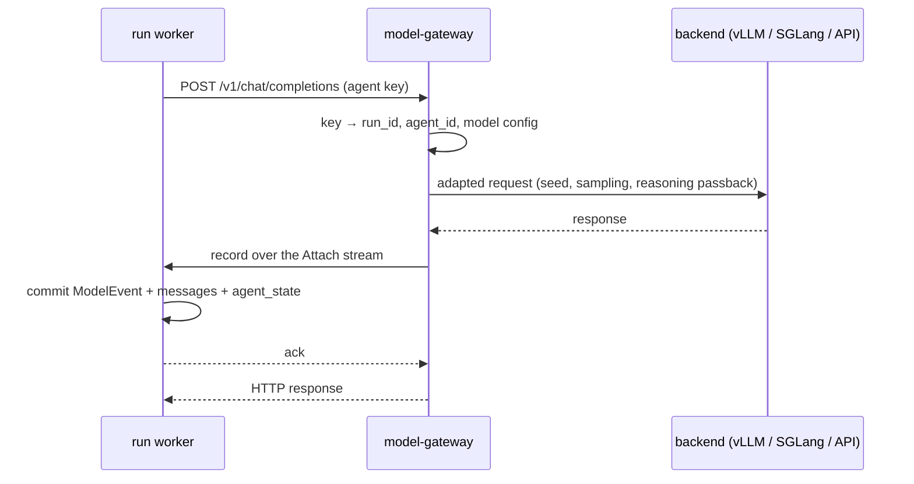

# model-gateway

Python. It is the only path from SwarmEval to a model. It serves an OpenAI-compatible API, adapts
each backend, and records every call as evidence for the run that made it. The `openai` SDK is
imported only here, in `swarmeval/gateway/model/`. Its place among the services is in
[architecture.md](../architecture.md).

**Status:** built for M0: the HTTP API, the `Attach` stream, backend adapters, and the worker's
client. Code: `swarmeval/gateway/model/`; contract: `proto/swarmeval/modelgw/v1/recorder.proto`.
Not built: per-key rate limits and streaming upstream. Items marked
*(proposed)* go beyond what the specs decided; they are listed under [Not settled](#not-settled).

```bash
swarmeval-model-gateway --config gateway.yaml --http 127.0.0.1:7080 --grpc 127.0.0.1:7081
```

Both addresses have no authentication beyond the virtual keys; bind them to the internal network.

## Callers

| Caller | Key | Recorded as |
|---|---|---|
| Run worker, for an agent | One virtual key per agent per run, registered when the worker attaches | Run evidence: a `ModelEvent` committed by the run's worker before the response is returned |
| Run worker, for an extension's own model calls, such as the `swarmeval.bus.paraphrase` intervention | One virtual key per extension instance per run (`extension:<instance>`), registered with the agents' keys | Run evidence, the same way, as a `ModelEvent` with no agent and the instance as its `extension` |
| [analysis](analysis.md), for the LLM judge | One analysis key, from the environment variable the config's `analysis_key_env` names (at least 32 characters). Unset, no analysis call is served | Not run evidence. Answered directly, with no `Attach` stream; analysis stores the call with its verdict |

Sandboxes cannot reach model-gateway, and neither can [net-gateway](net-gateway.md).

## Interfaces

**HTTP**, served by FastAPI:

- `POST /v1/chat/completions`, the subset of the OpenAI Chat Completions protocol SwarmEval uses
  (`swarmeval/gateway/model/wire.py`): messages, function tools, `temperature`, `top_p`,
  `max_completion_tokens`, `seed`. Any other field is refused, and so is `stream: true`. Past
  reasoning travels as `reasoning_content` on assistant messages.
- `GET /v1/models`: the model names cases may use.
- Authentication is `Authorization: Bearer <virtual key>`. Each call also carries the caller's
  `X-SwarmEval-Call-Id`, which the gateway echoes in the call's record.

| Status | `error.code` | When |
|---|---|---|
| 400 | `missing_call_id`, `invalid_request` | No call id, or a body outside the subset |
| 404 | `model_not_found` | The model name has no route |
| 502 | `upstream_error` | The backend failed after the SDK's retries, or returned no usage. No record is made |
| 503 | `run_not_attached` | The key belongs to no attached run, or the stream went away, or the worker rejected the record |

Callers get a complete, non-streamed response. When a backend needs streaming, for example to
avoid timeouts during long reasoning, the gateway streams upstream and assembles the result
*(proposed)*.

**gRPC**, service `swarmeval.modelgw.v1.RecorderService` *(proposed)*:

- `Attach(stream AttachRequest) returns (stream AttachResponse)` is a bidirectional stream per
  run, opened by the run's worker.
- The worker's first message is a `Hello` with `run_id`, `owner_epoch`, and the run's keys, each
  naming its caller (`agent:<id>` or `extension:<instance>`). The gateway answers `Attached` once
  the keys accept calls. The worker generates fresh keys per run.
- After that, the gateway sends one `CallRecord` per call: the call id, caller, the sha256 of the
  request body as received, the normalized response, the backend's raw response, what was sent
  upstream, latency, and attempts. The worker answers each with `Ack` (the committed event's id)
  or `Reject`.

The worker dials the gateway, not the other way round, so the gateway never looks up who owns a
run. If a stream for the same run attaches with a higher `owner_epoch`, the older one is closed
with `ABORTED`; an equal or lower epoch is refused with `FAILED_PRECONDITION`. That is how
takeover moves the stream.

**Worker client.** `swarmeval.gateway.model.client.GatewaySession` implements the runtime's
`ModelClient` for one run. It attaches on entry and detaches on exit. For each call it commits
the record as a `ModelEvent` through the run's `RunWriter`, then acks. It refuses a record whose
request hash differs from the body it sent, and a response that differs from the one recorded,
because either would split the evidence from what the agent saw. It replaces NUL in model output,
which Postgres `jsonb` rejects. After a commit fails or the stream drops, every later call on the
session fails.

## A recorded call



- **Fail closed.** If no stream is attached for a key's run, the gateway answers `503` with
  code `run_not_attached` and never calls the backend. If the stream drops while a call is in
  flight, the response is discarded and the call fails the same way. The worker treats both as an
  infrastructure failure and pauses the run. The agent never sees the error.
- **No response cache.** A call whose record was never committed is simply resent after recovery
  and sampled again. The agent never saw the lost response.
- **Retries.** The `openai` SDK retries connection errors, 429s, and 5xx itself. Each attempt is
  counted in the record's metadata, and only the final response becomes the `ModelEvent`.
- **Ack timeout.** A record not acknowledged within 120 s fails the call with `503`.

## Backend adapters

Backends are configured per deployment, in the YAML file given to `--config`. Credentials come
from deployment secrets and never from a case: a backend names the environment variable holding
its key.

```yaml
backends:
  vllm_local:
    base_url: http://vllm:8000/v1
    api_key_env: VLLM_API_KEY          # omit for a backend without auth
    reasoning_passback: within_turn
    weights_hash: sha256:9f2c…
    defaults: { temperature: 0.6, top_p: 0.95, seed: 0 }
    timeout_s: 600
    max_retries: 2
models:                                # the names cases write → where they are served
  qwen3-8b: { backend: vllm_local, upstream_model: Qwen/Qwen3-8B }
analysis_key_env: SWARMEVAL_ANALYSIS_KEY   # optional: the key analysis jobs call with
```

| Setting | Effect |
|---|---|
| `base_url`, `api_key_env` | Target of `AsyncOpenAI` |
| `reasoning_passback` (`none`, `within_turn`, `all`) | Which past reasoning the gateway keeps in the history it sends upstream. `within_turn` keeps it only after the last user message. Default `within_turn`. Recorded on every event |
| `defaults` | Sampling defaults and `seed`, applied unless the request sets them. What was actually sent is always recorded |
| `weights_hash` | For self-hosted backends. Recorded on every event; the model name the backend reports is recorded as `served_model` for all of them |
| `timeout_s`, `max_retries` | Passed to the SDK |

When reading a response:

- `reasoning_content`, or `reasoning` in newer vLLM, is read from `message.model_extra`.
- The backend's response body is recorded as received next to the split reasoning and content,
  because vLLM and SGLang reasoning parsers get the split wrong when a model mangles its
  `<think>` tags.
- Tool calls come from the server's parser. When parsing fails, the server returns the text as
  content, and the agent gets a response with no tool calls.
- The `model` in the response is the name the caller used; the backend's name for it is in the
  record.
- The record also carries token usage, latency, and `reasoning_visibility` (`full` in phase one,
  since it only covers open-weight models). A response without usage fails the call, because
  budgets depend on it.

Budgets are not enforced here. The worker deducts tokens when it commits each record.

## Rate limits and replicas

Each key has a token bucket in process (not built yet). In v1 a deployment runs one replica *(proposed)*: a call
and its run's `Attach` stream must meet in the same process, and the gateway is a thin async proxy
whose cost is dwarfed by inference. Running more replicas needs routing by `run_id`, for both the
HTTP calls and the stream, to one replica.

## Tech choices

Libraries shared by every Python service are in [tech-stack.md](../tech-stack.md). This service
also uses the following:

| Need | Choice | Why |
|---|---|---|
| HTTP API | FastAPI + uvicorn | Async and typed through pydantic, which the rest of the code already uses |
| Upstream | `openai` SDK (`AsyncOpenAI`), only in `upstream.py` | Mature and async, with transport retries built in. Phase one speaks only Chat Completions, so no translation layer is needed |
| Worker client HTTP | `httpx2` | The maintained successor of httpx, and the client the `openai` SDK itself uses, so there is one HTTP stack |
| Rate limits | A token bucket per key, in our own code | About 20 lines, and the semantics are ours (per key, per run). No library would save anything |

LiteLLM is not used: phase one needs no protocol translation, and translation obscures what the
model actually emitted. Phase two (closed models) will add native adapters.

## Testing

Tests point the gateway at a mock OpenAI-compatible server (`tests/gateway/mock_backend.py`) that
replays scripted responses, including reasoning fields, error statuses, and NUL in output. It is
served in process through `httpx2.ASGITransport`, and so is the gateway's HTTP API; the
`Attach` stream runs over a real local gRPC server. No test calls a live model.

## Not settled

1. The `RecorderService.Attach` stream, dialed by the worker, and the 120 s ack timeout.
2. One analysis key for every analysis job, rather than one per job.
3. Streaming upstream while returning complete responses.
4. One replica in v1.
5. Upstream errors (`502`) fail the run in M0: an agent whose context outgrew the model's window
   ends the run instead of seeing an error it could react to.
