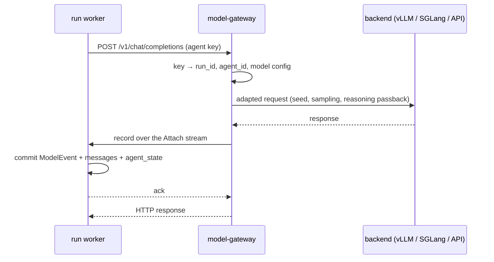

# model-gateway

Python. It is the only path from SwarmEval to a model. It serves an OpenAI-compatible API, adapts
each backend, and records every call as evidence for the run that made it. The `openai` SDK is
imported only here, in `swarmeval/gateway/model/`. Its place among the services is in
[architecture.md](../architecture.md).

**Status:** not built. Arrives in M0. Items marked *(proposed)* go beyond what the specs decided;
they are listed under [Not settled](#not-settled).

## Callers

| Caller | Key | Recorded as |
|---|---|---|
| Run worker, for an agent | One virtual key per agent per run, registered when the worker attaches | Run evidence: a `ModelEvent` committed by the run's worker before the response is returned |
| Run worker, for the Message Bus `paraphrase` intervention (M3) | A bus key for the run | Run evidence, the same way |
| [analysis](analysis.md), for the LLM judge | A key per analysis job | Not run evidence. Returned directly, and analysis stores the call with its verdict *(proposed)* |

Sandboxes cannot reach model-gateway, and neither can [net-gateway](net-gateway.md).

## Interfaces

**HTTP**, served by FastAPI:

- `POST /v1/chat/completions`, the OpenAI Chat Completions protocol.
- `GET /v1/models`.
- Authentication is `Authorization: Bearer <virtual key>`.

Callers get a complete, non-streamed response. When a backend needs streaming, for example to
avoid timeouts during long reasoning, the gateway streams upstream and assembles the result
*(proposed)*.

**gRPC**, service `swarmeval.modelgw.v1.Recorder` *(proposed)*:

- `Attach(stream WorkerMessage) returns (stream GatewayMessage)` is a bidirectional stream per run,
  opened by the run's worker.
- The worker's first message carries `run_id`, `owner_epoch`, and the run's keys, each with its
  `agent_id` and model configuration.
- After that, the gateway sends one record per call, and the worker answers each with an ack once
  it has committed the record.

The worker dials the gateway, not the other way round, so the gateway never looks up who owns a
run. If a stream for the same run attaches with a higher `owner_epoch`, the older one is closed.
That is how takeover moves the stream.

## A recorded call

- **Fail closed.** If no stream is attached for a key's run, the gateway answers `503` with
  code `run_not_attached` and never calls the backend. If the stream drops while a call is in
  flight, the response is discarded and the call fails the same way. The worker treats both as an
  infrastructure failure and pauses the run. The agent never sees the error.
- **No response cache.** A call whose record was never committed is simply resent after recovery
  and sampled again. The agent never saw the lost response.
- **Retries.** The `openai` SDK retries connection errors, 429s, and 5xx itself. Each attempt is
  counted in the record's metadata, and only the final response becomes the `ModelEvent`.

## Backend adapters

Backends are configured per deployment. Credentials come from deployment secrets and never from a
case.

| Setting | Effect |
|---|---|
| `base_url`, `api_key` | Target of `AsyncOpenAI` |
| `reasoning_passback` (`none`, `within_turn`, `all`) | Which past reasoning the gateway keeps in the history it sends upstream. Recorded on every event |
| Sampling defaults, `seed` | Applied unless the case overrides them. Always recorded |
| `weights_hash` | For self-hosted backends. Recorded on every event; hosted APIs record the version the provider returns instead |

When reading a response:

- `reasoning_content` and other non-standard fields are read from `message.model_extra`.
- The raw output text is recorded next to the split reasoning and content, because vLLM and SGLang
  reasoning parsers get the split wrong when a model mangles its `<think>` tags.
- Tool calls come from the server's parser. When parsing fails, the raw text is recorded and the
  agent gets a response with no tool calls.
- The record also carries token usage, latency, and `reasoning_visibility` (`full` in phase one,
  since it only covers open-weight models).

Budgets are not enforced here. The worker deducts tokens when it commits each record.

## Rate limits and replicas

Each key has a token bucket in process. In v1 a deployment runs one replica *(proposed)*: a call
and its run's `Attach` stream must meet in the same process, and the gateway is a thin async proxy
whose cost is dwarfed by inference. Running more replicas needs routing by `run_id`, for both the
HTTP calls and the stream, to one replica.

## Tech choices

Libraries shared by every Python service are in [tech-stack.md](../tech-stack.md). This service
also uses the following:

| Need | Choice | Why |
|---|---|---|
| HTTP API | FastAPI + uvicorn | Async and typed through pydantic, which the rest of the code already uses |
| Upstream | `openai` SDK (`AsyncOpenAI`) | Mature and async, with transport retries built in. Phase one speaks only Chat Completions, so no translation layer is needed |
| Rate limits | A token bucket per key, in our own code | About 20 lines, and the semantics are ours (per key, per run). No library would save anything |

LiteLLM is not used: phase one needs no protocol translation, and translation obscures what the
model actually emitted. Phase two (closed models) will add native adapters.

## Testing

Tests point the gateway at a mock OpenAI-compatible server that replays scripted responses,
including reasoning fields and malformed tool calls. It also lets tests reproduce multi-agent
timing. No test calls a live model.

## Not settled

1. The `Recorder.Attach` stream, dialed by the worker.
2. Judge calls from analysis returned directly, without a run to commit them.
3. Streaming upstream while returning complete responses.
4. One replica in v1.
