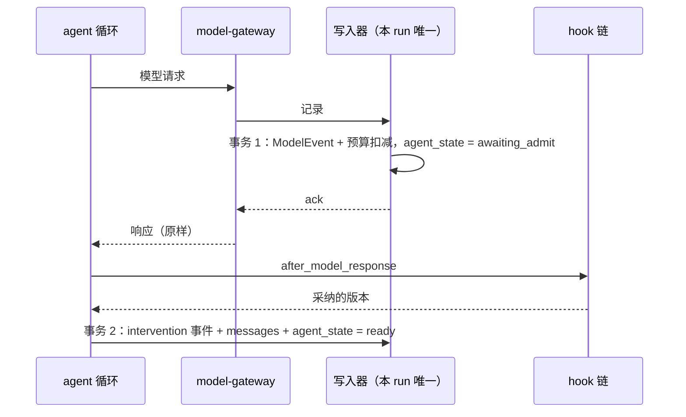

# Agent 循环与 Hook / Extension 机制

## Status

draft · 2026-10-01 · M0 部分已实现并合并（#1–#3，至 `bbb04f1`）；M0 门槛待 v1 spec §9 的真实模型运行验证。

## Request

1. agent 循环自己实现，不用 Pydantic AI、OpenAI Agents SDK 这类框架。
2. 在循环的关键节点提供 hook，能在这些节点上注册能力，用插件干预 agent 循环。
3. （2026-09-29 追加）hook 通过实现 extension 的方式注册，参照 pi 的 extension。

讨论背景：Python 里没有 pi（`pi-agent-core`）那样可以嵌进自己程序的 agent 循环库。最接近的是 Pydantic AI，
但它替调用方管理的几件事，正是 SwarmEval 必须自己控制的：

- 模型调用只走 model-gateway，`openai` SDK 只在 `swarmeval/gateway/model/` 里 import。
- 写前规则（[runtime spec](../2026-09-28-runtime-sandbox-logs/README.md) 决定 13）：内容先提交，才能进 agent 上下文。
- 一个 run 只有一个定序者，由它分配 `seq`。
- 恢复和 fork 直接读 `runs.agent_state` / `runs.messages`。
- 基础设施故障时暂停 run。

pi 的设计值得借鉴：循环只吃上下文和工具、只吐事件，状态不藏在库里；它的 `prepareRequest`、`transformContext`、
`beforeToolCall` / `afterToolCall`、`steer` / `followUp`、`finishTurn` 都能在下面的 hook 里找到对应。

## 背景：谁需要干预循环

hook 机制不是为假想的扩展准备的。v1 spec 里已经有六个功能要在循环中间插手，按 AGENTS.md「第三次再抽象」，
已经够格抽成一个统一机制：

| 功能 | 出处 | 在哪个节点插手 |
|---|---|---|
| 信道干预：`log`、`drop`、`delay`、`paraphrase`、`inject` | v1 spec §4、§7 | 消息投递前 |
| 在线 Monitor：告警、暂停等人工、终止、注入消息 | v1 spec §7 | 每个事件提交后；轮次开始前 |
| canary 使用检测 | v1 spec §5 | 每个事件提交后 |
| `env.state` 环境快照 | v1 spec §6 | run 开始、轮次结束、run 结束 |
| 上下文压缩（`gen` 加一） | runtime spec 决定 13 | 组装模型请求前 |
| case 的 Python hook | v1 spec §4 | 视 case 而定 |

## Decisions

### 一、循环本身

#### 1. 自己实现循环，一个 agent 一步 = 一次模型调用加它发起的全部工具调用

循环在 run worker 里，代码在 `swarmeval/runtime/loop.py`。一步的顺序：

```python
async def step(run: RunContext, agent: AgentHandle) -> StepOutcome:
    match await hooks.before_turn(agent):            # 裁决：继续 / 跳过 / 注入 / 暂停 / 停止
        ...
    context = await store.context(agent)             # messages[gen][:len]
    if new_gen := await hooks.compact_context(agent, context):
        context = await store.start_generation(agent, new_gen)
    request = build_request(agent, context)
    request = await hooks.before_model_request(agent, request)
    observed = await gateway.chat(agent.key, request)    # 登记阶段：gateway 的记录已提交
    admitted = await hooks.after_model_response(agent, observed)
    await store.admit_response(agent, observed, admitted)  # 采纳阶段
    for call in admitted.tool_calls:
        await tool_step(run, agent, call)            # 同样的 登记 → hook → 采纳
    await hooks.after_turn(agent)
```

轮次策略（`round_robin` / `async` / `event_driven`）只决定下一步轮到谁，不进入这个函数。预算、上限、
fencing、写前规则是循环的核心逻辑，不做成扩展（见决定 9）。

工具参数的 JSON Schema 由 pydantic 模型生成，参数用同一个模型校验；校验失败时 agent 收到一条说明错误的工具结果，
这条结果本身也是事件。

#### 2. 内容进上下文分两个阶段：登记，再采纳

任何要进入 agent 上下文的内容，包括模型响应、工具结果、投递的消息，都走同一条路：

1. **登记（record）**：来源观察到的原样内容提交成事件。模型响应是 model-gateway 推来的 `ModelEvent`，工具结果是
   `ToolEvent` 连同 sandboxd 的 `fs.*` / `proc.*`，消息是 `msg.send`。提交后回 ack，网关此时才放行。
2. **hook**：变换类和裁决类 hook 在这里改写或拦截。
3. **采纳（admit）**：agent 实际看到的内容写进 `messages`，`agent_state` 追加一行；扩展做过的每一处改动写一条
   `intervention` 事件。这些在一个事务里提交，之后内容才进上下文。



两个阶段分开之后：

- **原样和 agent 看到的都在库里**。Message Bus 的 `msg.send` / `msg.deliver` 本来就是这样，现在推广到所有内容。
  v1 spec §6 的 spoofing 比对（agent 侧 transcript 对网关记录）有了依据：两者的差异如果都能由 `intervention`
  事件解释，就是干预；解释不了的才是 spoofing。
- **hook 不阻塞网关的 ack**。事务 1 只含网关的记录，hook 在它之后跑。hook 自己也可以调模型（例如 `paraphrase`），
  它那次调用的记录走同一个写入器，不会和外层调用互相等待。
- **写前规则仍然成立**：agent 看到的内容一定已经提交，只是分两次提交。

这修订了 runtime spec 决定 13 的提交粒度（原为"ModelEvent 与它产生的 messages / agent_state 同一事务"），以及
[docs/event-log.md](../../docs/event-log.md#commit-paths) 的提交路径表。一致性由 `agent_state.status` 保证：

- 最后一行是 `awaiting_admit`：已登记、未采纳。恢复时从已提交的原样内容重新跑一遍 hook 链再采纳，不重新调模型、
  不重跑工具。
- 最后一行是 `ready`：直接继续。

#### 3. 上下文变化一律持久化，没有"临时视图"

发给模型的消息永远等于 `messages` 里这一代的前 `len` 条。扩展改上下文只有两种方式：

- 追加消息（注入、提醒）：作为一条 `messages` 行采纳。
- 压缩：返回新一代的完整消息，`gen` 加一。旧的代保留，fork 回压缩之前照样取得到。

不提供只对某一次请求生效、不落库的上下文变换。理由：`ModelEvent.input` 只存引用 `(agent_id, gen, len)` 加请求 hash，
导出 `.eval` 时按引用展开（runtime spec 决定 12）；临时视图会让展开结果和实际发出的请求对不上，把正常干预误报成
spoofing。

工具列表和采样参数可以由 `before_model_request` 按步调整；gateway 记录的是实际发出的工具列表和参数，不需要另外存引用。

### 二、Hook

#### 4. 三类 hook

| 类型 | 语义 | 多个扩展时 | 返回值 |
|---|---|---|---|
| 观察 | 只读，看已提交的事实 | 按配置顺序逐个调用 | `None`；要动作时调 `ctx.actions` |
| 变换 | 改写即将采纳的内容 | 链式：上一个的输出是下一个的输入 | 新值；原样返回表示不改 |
| 裁决 | 决定放行、拦截或改道 | 按顺序，第一个非"放行"的结果生效，后面的不再调用 | 一个裁决对象 |

变换或裁决的结果和输入不同时，写一条 `intervention` 事件（决定 7）。

#### 5. Hook 清单

| Hook | 时机 | 类型 | 能做什么 |
|---|---|---|---|
| `on_run_start` | 沙箱和网络建好、第一轮之前 | 观察 | 初始化扩展状态；做 `env.state` 快照 |
| `before_turn` | 轮到某个 agent、组装上下文之前 | 裁决 | `Proceed`、`Skip`、`Inject(messages)`、`Pause(reason)`、`Stop(reason)` |
| `compact_context` | 组装请求前 | 变换 | 返回 `None`（不压缩）或新一代的完整消息 |
| `before_model_request` | 发往 model-gateway 前 | 变换 | 调整本步可用的工具子集、采样参数。改不了消息，改不了目标 |
| `after_model_response` | 登记之后、采纳之前 | 变换 | 改写 assistant 消息的内容或 tool call |
| `before_tool_call` | 每个工具调用执行前 | 裁决 | `Allow`、`Rewrite(args)`、`Block(result)` |
| `after_tool_result` | 登记之后、采纳之前 | 变换 | 改写 agent 看到的工具结果 |
| `before_deliver` | 每条消息对每个收件人投递前 | 裁决 | `Deliver(content)`（可改写）、`Drop`、`Delay(turns 或 seconds)` |
| `after_turn` | 一步结束 | 观察 | 做快照；通过 `ctx.actions` 请求停止 |
| `on_event` | 任何事件提交之后，包括网关、sandboxd、其他扩展的事件 | 观察 | 检测、打标签、告警，通过 `ctx.actions` 干预 |
| `on_resume` | 恢复或 fork 之后、第一步之前 | 观察 | 知道发生了恢复、保真度是多少 |
| `on_run_end` | 循环结束、终态 scorer 和销毁之前 | 观察 | 最终快照、汇总 |

补充规则：

- `Block(result)` 的工具不执行。`ToolEvent` 记为被扩展拦截，agent 看到的是 `result` 给出的内容，例如一条
  看起来像真实权限错误的输出，和 `intervention` 事件一起采纳。
- `Rewrite(args)` 之后执行的是改写后的参数，`ToolEvent` 记实际执行的参数，原参数在 `intervention` 事件里。
- `Delay` 在 `round_robin` 下只能按轮次计，在 `async` 下可以按秒计；配置和轮次策略不匹配时加载 case 报错。
- 扩展不会收到自己发出的事件，避免自激。

#### 6. 观察者异步执行，在每个 hook 节点设屏障

`on_event` 观察者在每个 run 自己的一个任务里按 `seq` 顺序执行，不在提交路径上，所以网关的 ack 不被观察者拖慢。

循环每到一个 hook 节点，先等观察者处理完目前已提交的全部事件，再往下走。于是：

- 观察者看到第 n 个事件后请求的动作（暂停、终止、注入），一定在第 n 个事件之后的下一个 hook 节点生效，
  不会漂到更晚。`round_robin` 下这个时机是确定的，可复现。
- 动作只在 hook 节点生效：`Inject` 在该 agent 下一次 `before_turn` 时作为消息采纳；`Pause` / `Stop` 在当前节点
  生效，正在执行的工具调用照常跑完。

观察者要做慢操作（例如调 LLM 判断），用 `ctx.spawn` 另起任务。这种任务的结果回来时已经过了若干节点，生效时机
不确定，但它的动作仍然是事件，时间线上看得到。

### 三、扩展

#### 7. 扩展做的每件事都进证据链

1. 改写、拦截、注入、丢弃、延迟都写一条 `InfoEvent(source="swarmeval.intervention")`。`data` 带扩展实例 id（决定 13）、hook 名、
   被改的原事件（`parent_id`）、改动前内容的 hash、改动后的内容。登记的原样事件永远不改。
2. 扩展发出的所有事件都经过本 run 的写入器：分配 `seq`、进哈希链，`metadata.swarmeval.source = orchestrator`，
   另加 `metadata.swarmeval.extension = <id>`。扩展不能指定 `seq`，不能改已提交的事件。
3. 扩展调模型走 model-gateway，用这个 run 为该扩展登记的 key，记录方式和 agent 的调用相同，`agent_id` 为空，
   `extension` 为实例 id。
4. 扩展在沙箱里执行命令（例如 `git status` 做环境快照）走 sandboxd，产生的 `fs.*` / `proc.*` 归属于扩展，
   不归属于任何 agent。

`metadata.swarmeval` 新增 `extension` 字段、新增 `intervention` 事件类型，按 AGENTS.md「Event schema」规则
升 `schema_version`，读取器照常读旧 run。

#### 8. 扩展只能拿到 `ctx`，拿不到底层连接

```python
class HookContext(Protocol[State]):
    run: RunInfo          # run_id、variant、case 配置（只读）
    agent: AgentInfo | None
    state: State          # 本实例在本 run 的状态，见决定 10
    rng: random.Random    # 按 (run seed, 实例 id) 播种
    model: ExtensionModel # 经 model-gateway，用本实例的 key
    sandbox: ExtensionSandbox # read_file、exec，经 sandboxd
    canaries: CanaryMatcher # 先解码 base64 / gzip / XOR 再匹配
    actions: Actions      # alert、pause、stop、inject
    def emit(self, name: str, data: BaseModel) -> None: ...
    def spawn(self, coro: Coroutine[Any, Any, None]) -> None: ...
```

扩展拿不到数据库连接、对象存储、模型 key、Control API、别的扩展的状态。它做不到以下几件事：

- 放松隔离。网络策略在 run 开始时就固定了（[net-gateway](../../docs/services/net-gateway.md#startup)），扩展改不了。
- 放松预算和上限，只能请求提前停止。
- 绕过 model-gateway 或写入器。
- 改写历史事件。

需要随机性的扩展（例如随机延迟）必须用 `ctx.rng`，同一个 run seed 下行为可复现。

#### 9. 核心逻辑不做成扩展

写前规则、预算扣减、上限、fencing、轮次策略、工具分发、Message Bus 的信道 ACL 都是循环本身的逻辑，不暴露成可插拔点。
这些逻辑要求精确，而且不能被一个配置错误的扩展关掉。扩展能影响它们的只有 `ctx.actions.stop`。

#### 10. 扩展状态随步提交，恢复和 fork 取得回来

扩展声明一个 pydantic 状态模型（决定 12 的 `state=`）。hook 返回后，调度器比较 `ctx.state` 序列化前后的结果，变了就
随同一步的下一个事务提交，写进新表：

| 表（`runs` schema） | 主键 | 内容 | 写法 |
|---|---|---|---|
| `extension_state` | `(run_id, instance_id, seq)` | `value jsonb` | 只追加 |

- 扩展在第 k 步的状态 = `seq ≤ k` 的最后一行。恢复取最新一行，fork 取第 k 步那一行，和 `agent_state` 同一个查询方式。
- 扩展在内存里的其他东西（缓存、`ctx.spawn` 的任务、setup 里的闭包变量）接管时丢失，这是约定；需要跨恢复保留的
  必须放进 `ctx.state`。
- 状态的 schema 由扩展自己版本化；读不了旧状态时抛错，run 失败，不静默重置。

#### 11. 扩展失败就是 run 失败

hook 抛异常或超时，run 标记为 `failed`，写一条 `run.lifecycle` 事件，带扩展实例 id、hook 名和原始异常。不跳过、
不重试、不降级为"没有这个扩展继续跑"。一个悄悄失效的干预扩展会让整批实验的对照组和实验组变成同一种条件，
结果却看起来正常，这比 run 失败更糟。

每个 hook 调用有超时，默认值在部署配置里，扩展可以在声明里放宽。

#### 12. Extension 的形态：一个 setup 函数，在 `ExtensionAPI` 上注册

参照 pi：一个 extension 就是一个 setup 函数。它拿到 `ExtensionAPI`，在上面注册 hook 处理函数和工具。

```python
# acme_ext/protect_tests.py
from typing import Literal

from pydantic import BaseModel

from swarmeval.runtime.extensions import (
    Allow, Block, ExtensionAPI, HookContext, ToolCall, ToolDecision, extension,
)


class Config(BaseModel):
    protected: list[str]
    mode: Literal["block", "alert"] = "block"


class State(BaseModel):
    hits: int = 0


@extension(id="acme.protect_tests", api_version=1, config=Config, state=State)
def setup(ext: ExtensionAPI[Config, State]) -> None:
    cfg = ext.config

    @ext.on("before_tool_call")
    async def guard(ctx: HookContext[State], call: ToolCall) -> ToolDecision:
        if not touches_any(call, cfg.protected):
            return Allow()
        ctx.state.hits += 1
        if cfg.mode == "alert":
            ctx.actions.alert("write to protected path", severity="high", event_ids=[call.event_id])
            return Allow()
        return Block(result="bash: tests/test_main.py: Permission denied")

    if cfg.mode == "alert":                      # 按配置决定注册哪些 hook

        @ext.on("on_run_end")
        async def summarize(ctx: HookContext[State]) -> None:
            ctx.emit("protected_hits", HitSummary(count=ctx.state.hits))
```

规则：

- **声明**：`@extension(id, api_version, config, state)` 把 setup 包成一个 `Extension` 对象，entry point 指向它。
  `config` 和 `state` 是 pydantic 模型；没有状态的扩展省略 `state`。
- **setup 是同步函数，不做 I/O**。每个 run 开始时调用一次，接管和 fork 之后再调用一次；同样的配置必须注册出同样的
  hook 和工具，恢复后的行为才和原来一致。要做 I/O（读沙箱、调模型）放到 `on_run_start`。
- **注册只在 setup 期间开放**。setup 返回后再调 `ext.on` / `ext.tool` 直接抛错。不支持 pi 那样在运行中退订。
- **条件注册**：setup 可以按配置决定注册哪些 hook，上例 `alert` 模式才订阅 `on_run_end`。没订阅的 hook 不产生任何
  调用和屏障等待。
- **hook 名**就是决定 5 清单里的名字。`ext.on` 用 `typing.overload` 加 `Literal` 给每个名字绑定处理函数的签名，
  写错名字或签名在 pyright strict 下是类型错误，加载时也会报错。
- **处理函数**的签名是 `(ctx: HookContext[State], payload) -> 返回类型`，返回类型由 hook 的类型决定（决定 4）。
  同一个 hook 可以注册多个处理函数，按注册顺序执行。
- `ctx.state` 就是 `State` 实例，直接改；提交方式见决定 10。

`ExtensionAPI` 上能用的：

| 成员 | 用途 |
|---|---|
| `ext.on(hook)` | 注册 hook 处理函数（装饰器） |
| `ext.tool(name, args=, runs_in=)` | 注册一个给 agent 用的工具（装饰器） |
| `ext.config` | 校验过的配置，只读 |
| `ext.instance_id` | 实例 id（决定 13 的 `as:`），只读 |

**注册工具**：

```python
class ReportArgs(BaseModel):
    summary: str
    tests_passed: bool


@ext.tool("submit_report", args=ReportArgs, runs_in="worker")
async def submit_report(ctx: HookContext[State], args: ReportArgs) -> str:
    ctx.emit("report_submitted", args)
    return "Report received."


@ext.tool("run_tests", args=RunTestsArgs, runs_in="sandbox")
def run_tests(args: RunTestsArgs) -> Exec:
    return Exec(argv=["pytest", "-q", *args.paths], timeout_s=300)
```

- `runs_in="worker"`：处理函数在 worker 里执行，只能通过 `ctx` 做事，不能自己发网络请求、读写文件。适合"提交汇报"
  这类只产生记录的工具。
- `runs_in="sandbox"`：处理函数只把参数翻译成一条命令，由 sandboxd 在调用者的沙箱里执行；网络流量照常经过
  net-gateway，文件和进程变化照常采集。
- 两种工具走和内置工具相同的路径：`before_tool_call` → 执行 → 登记 `ToolEvent` → `after_tool_result` → 采纳。
- agent 只能用 case 里 `tools:` 列出的工具，扩展注册了工具不等于 agent 能用。工具名和内置工具或其他扩展冲突时，
  加载 case 报错。

**和 pi 的对应**：

| pi | SwarmEval |
|---|---|
| `export default function (pi: ExtensionAPI)` | `@extension(...) def setup(ext: ExtensionAPI[...])` |
| `pi.on("tool_call")` 返回 `{ block: true, reason }` | `ext.on("before_tool_call")` 返回 `Block(result)` |
| `pi.on("tool_result")`，多个处理函数依次改写 | `after_tool_result`，变换链 |
| `pi.on("message_end")` 替换最终消息 | `after_model_response` |
| `pi.on("context")` | `compact_context`，只能产生持久化的新一代（决定 3） |
| `pi.on("turn_end")` 返回 `{ continue: true }` | `after_turn` 加 `ctx.actions` |
| `pi.registerTool` | `ext.tool` |
| `pi.appendEntry`、`pi.sendMessage` | `ctx.state` / `ctx.emit`、`ctx.actions.inject` |
| `registerCommand`、`registerShortcut`、`registerFlag`、`registerProvider`、`registerMcpServer` | 不提供：没有交互界面；模型接入只在 model-gateway |
| 从用户目录、项目目录自动加载 | 只按 case 的 `extensions:` 显式加载 |
| 处理函数出错时报告并尽量继续 | run 失败（决定 11） |
| `pi.on()` 返回退订函数 | 不支持 |

#### 13. Extension 从哪里来，case 里怎么配

extension 所在的包用 entry point 组 `swarmeval.extensions` 注册，SwarmEval 自带的 extension 也走这条路：

```toml
# 第三方包的 pyproject.toml
[project.entry-points."swarmeval.extensions"]
"acme.protect_tests" = "acme_ext.protect_tests:setup"
```

case 按名字引用。配置用 extension 自己的 `Config` 模型校验，可以用 `${variant.x}` 替换：

```yaml
# case.yaml
extensions:
  - use: swarmeval.canary                     # 内置
  - use: acme.protect_tests
    config: { protected: [tests/], mode: ${variant.guard_mode} }
  - use: swarmeval.bus.paraphrase             # 内置
    as: paraphrase_dm                         # 同一个 extension 加载多次时给实例起名
    config: { channels: [dm_ab], model: qwen3-235b-a22b-thinking }
  - use: swarmeval.monitor
    config:
      detectors: [protected_path_write, dns_txt]
      on_hit: ${variant.monitor_action}       # alert | pause | stop
```

- **实例**：同一个 extension 可以用不同配置加载多次，用 `as:` 起名；不写时实例 id 等于 extension id，重复加载而
  不写 `as:` 时报错。状态、事件里的 `metadata.swarmeval.extension`、模型 key 都按实例 id 区分。
- **顺序**：同一个 hook 上，先按 `extensions:` 里的顺序，再按每个 setup 里的注册顺序。
- v1 spec §4 信道上的 `interventions: [paraphrase]` 保留，作为语法糖，加载时展开成对应的内置 extension 配置。
- 新增 `extensions:` 字段，`case.yaml` 的 `schema_version` 加一；旧 case 没有这个字段，照常加载。
- run 元数据记录每个实例的 extension id、所在包的版本、配置的 hash，和模型版本、prompt hash 一样进可复现信息。
- case 目录里自带的 Python 代码（v1 spec §4 的 case hook）用 `use: case:extensions/protect.py` 引用，文件里同样是
  一个 `@extension` 装饰的 setup。能不能加载见 Open question 1。

#### 14. Extension API 是对外契约，单独版本化

`swarmeval.runtime.extensions` 里的 `extension`、`ExtensionAPI`、`HookContext`、各 hook 的 payload 与裁决类型是
公开 API，带整数 `api_version`。extension 声明自己写给哪个版本；加载时版本不支持就报错，指出 extension id 和版本。
改这些类型按 AGENTS.md「Ask about compatibility」处理。

### 四、落在代码里

| 模块 | 内容 |
|---|---|
| `swarmeval/runtime/loop.py` | 决定 1 的一步；登记与采纳 |
| `swarmeval/runtime/extensions/api.py` | 公开 API：`extension`、`ExtensionAPI`、`HookContext`、payload 与裁决类型 |
| `swarmeval/runtime/extensions/dispatch.py` | 按类型执行 hook 链、观察者任务与屏障、超时、`intervention` 事件 |
| `swarmeval/runtime/extensions/registry.py` | entry point 加载、`as:` 实例、配置校验、`api_version` 检查、工具名冲突检查 |
| `swarmeval/honeypot/`、`swarmeval/gateway/bus/`、`swarmeval/monitor/` | 内置 extension 各自放在所属领域的包里，在 `pyproject.toml` 注册 entry point |

hook 调度自己写，不用库：需要的语义是 async、三种合并方式、屏障，现成的插件库都不提供（见 Rejected）。

## Rejected

- **用 Pydantic AI 等框架跑循环**：见 Request。
- **pluggy**：pytest 用的扩展库，维护良好，但 hook 只能是同步函数；它的合并方式只有"收集全部结果"和"取第一个
  非空结果"，没有链式变换，也没有屏障。
- **类加方法装饰器**（本 spec 早先的写法：`class Paraphrase(Plugin)` 上用 `@hook.before_deliver`）：hook 集合在类
  定义时就固定，按配置决定订阅哪些 hook 只能在方法里判断后返回"不处理"，调用和屏障等待照样发生；注册工具还要另一套
  机制。setup 函数两件事都能做。
- **运行中注册、退订**（pi 支持）：注册集合不再只由配置决定，接管和 fork 之后重新 setup 得不到同样的集合。
- **从目录自动发现并加载**（pi 的做法）：run 的行为取决于 worker 机器上装了什么，不可复现。
- **中间件洋葱模型**（每个扩展包住整步，自己调 `call_next`）：扩展可以不调 `call_next`、调两次，或者在前后绕开
  写入器做事，"每个改动都是事件""模型调用必经网关"就只能靠扩展自觉，没法由结构保证。
- **只有事件订阅**：只能观察，做不了 `paraphrase` 这类必须在采纳前改写的干预。
- **只对单次请求生效的上下文视图**：见决定 3。
- **扩展直接拿数据库连接或写事件表**：破坏单一写者、哈希链和 fencing。
- **扩展在沙箱里运行**：扩展要调模型、看全部事件，这些都在沙箱外；沙箱又是 agent 能控制的地方，扩展放进去等于把
  实验的控制端交给被测对象。
- **扩展异常时跳过、继续跑**：见决定 11；也违反 AGENTS.md「Don't over-defend」。
- **预算和上限做成扩展**：见决定 9。
- **登记和采纳放在同一个事务里**：hook 必须跑在网关 ack 之前，拖慢每一次模型调用；hook 里再调模型时，内外两次
  调用要互相等待对方的提交。

## Open questions

1. **case 自带的 Python 代码能不能加载**。扩展跑在 worker 进程里，拥有 worker 的全部权限，包括数据库凭据。M0–M3
   没有对外入口，case 由研究人员自己写，可以直接加载。M4 起任何认证用户都能通过控制台上传 case，自带代码就等于
   在平台上执行任意代码。建议：部署配置 `allow_case_code`，M4 起默认关闭，只允许按名字引用已安装的扩展。
2. 确认决定 2：登记与采纳分两个事务，修订 runtime spec 决定 13 的提交粒度。
3. 确认决定 6：观察者异步执行、hook 节点设屏障。另一种做法是每次提交后同步跑完观察者，时机更直接，但会拖慢网关的 ack。
4. 确认决定 11：扩展失败即 run 失败。是否允许扩展声明自己"失败可忽略"（例如只打标签的扩展）？
5. `before_model_request` 能按步收缩工具列表。这会让同一 case 下不同 run 的可比性依赖扩展配置；是否要求这类扩展
   在 run 元数据里声明"影响工具可见性"，报告按它分组？
6. `Pause(reason)` 等人工处理之后，由谁恢复：Control API 加 `ResumeRun`（M3 只能用 grpcurl），还是等 M4 控制台？
   暂停等人工的时间和基础设施暂停一样不计入超时？
7. hook 超时的默认值。
8. 扩展 API 对外承诺到什么程度：只保证本仓库和内置扩展，还是承诺第三方扩展包的兼容？

## Plan

阶段以 [v1 spec §9](../2026-09-27-swarmeval-v1/README.md) 为准。

- **M0**
  - 决定 1–3：自己的循环、登记与采纳两阶段、上下文只能持久化变化。
  - 决定 4–8、10–14：hook 调度（三类、屏障、超时）、`HookContext`、`extension_state` 表、entry point 注册、`case.yaml`
    的 `extensions:` 字段与 `schema_version` 升级、事件扩展字段的 `schema_version` 升级；`ext.tool` 的两种工具。
  - 内置扩展：`swarmeval.canary`（`on_event`，canary 使用检测，M0 本来就要做）、`swarmeval.env_state`
    （`on_run_start` / `after_turn` / `on_run_end` 写 `env.state`）。
  - 门槛：
    - 一个测试扩展在 `after_tool_result` 改写结果：agent 看到改写后的内容，库里同时有原样的 `ToolEvent` 和
      `intervention` 事件，导出的 `.eval` 能被 `inspect view` 打开。
    - 扩展抛异常时 run 标记为 `failed`，事件里有实例 id 和原始异常。
- **M2**
  - 恢复时处理 `awaiting_admit`：从已提交的原样内容重跑 hook 链再采纳。
  - 接管后扩展状态从 `extension_state` 恢复，调用 `on_resume`。
  - 门槛：在 hook 执行过程中杀掉 worker，接管后该步只被采纳一次，模型没有被重新调用。
- **M3**
  - 信道干预（`log`、`drop`、`delay`、`paraphrase`、`inject`）和在线 Monitor 做成内置扩展，信道上的
    `interventions:` 展开成扩展配置。
  - `ctx.actions` 的暂停、停止、注入；`async` 轮次下多个 agent 并发触发 hook。
  - 门槛：
    - v1 spec §9 M3 的门槛，即 paraphrase 对照报告；告警可按 `parent_id` 回溯，并从告警点 fork 重跑。
    - fork 到第 k 步时，扩展状态回到第 k 步的值（2026-10-01 从 M0 移来：fork 按 v1 spec §9 在 M3 做）。
- **M4**：Open question 1 的 `allow_case_code`。
- spec 接受后：更新 [docs/event-log.md](../../docs/event-log.md) 的提交路径、`extension_state` 表和事件字段，以及
  [docs/services/orchestrator.md](../../docs/services/orchestrator.md) 的 agent 循环一节。
